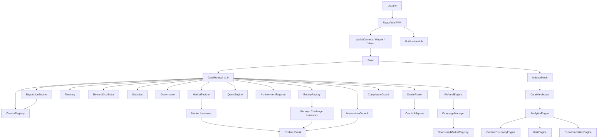
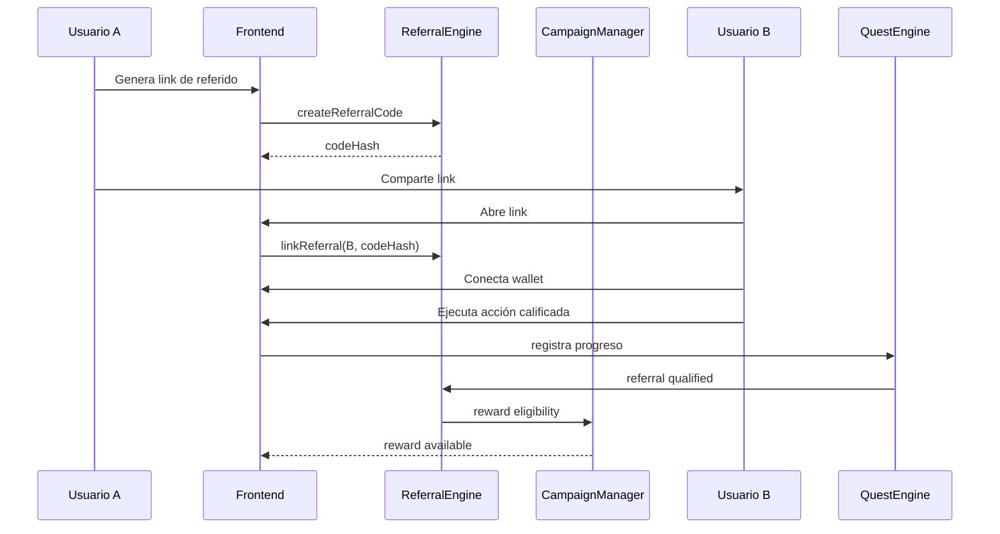
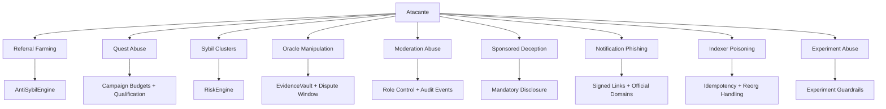

# Alterford Constitution v1.1

Version: `1.1`
Status: Enterprise reference specification
Base document: Alterford Constitution `v1.0`
Date: 2026-06-20
Language: Spanish

---

## 0. Control Constitucional

### 0.1 Naturaleza De Esta Versión

La Constitución Alterford `v1.1` es una ampliación compatible de la Constitución Alterford `v1.0`.

Esta versión:

- conserva todas las decisiones arquitectónicas, económicas, visuales, operativas y de seguridad de `v1.0`;
- no elimina módulos, contratos, rutas, stores, hooks, estados, eventos ni reglas definidos en `v1.0`;
- no modifica la filosofía económica de no house risk;
- no altera el split de comisión `3.5% = 2% admin + 1.5% creador`;
- reemplaza la garantía fija inicial de `10 USDT` por una política dinámica `CreationBondPolicy` compatible con la intención original: filtrar spam, reducir bots y exigir compromiso del creador sin bloquear mercados pequeños;
- no cambia Base como red principal inicial;
- no reemplaza el sistema dual `Vanilla / Underworld`;
- añade únicamente módulos complementarios para crecimiento viral, retención, reputación, analítica, monetización, moderación, oráculos y escalabilidad hacia millones de usuarios.

### 0.2 Relación Con v1.0

La Constitución `v1.0` sigue siendo normativa. La Constitución `v1.1` actúa como extensión natural del ecosistema.

Regla de precedencia:

1. Si una regla existe en `v1.0` y no se menciona en `v1.1`, permanece igual.
2. Si `v1.1` añade un módulo nuevo, este debe integrarse sin romper los módulos existentes.
3. Si una interpretación de `v1.1` contradice `v1.0`, prevalece `v1.0`.
4. Ningún módulo `v1.1` puede introducir riesgo de capital para la casa.
5. Ningún módulo `v1.1` puede mover fondos de Treasury sin autorización explícita del flujo económico original.

### 0.3 Principio De Expansión

Alterford evoluciona de un protocolo de mercados, bounties y desafíos hacia una red social financiera Web3 con:

- distribución viral;
- reputación verificable;
- social graph;
- creator economy avanzada;
- analítica operacional;
- moderación escalable;
- oráculos modulares;
- infraestructura preparada para millones de usuarios;
- monetización complementaria sin riesgo de contraparte de la casa.

---

## 1. Resumen Ejecutivo v1.1

Alterford `v1.1` introduce una capa de crecimiento, confianza y escala sobre la arquitectura base.

Los nuevos módulos complementarios son:

- `ReferralEngine`
- `QuestEngine`
- `AchievementRegistry`
- `ReputationEngine`
- `SocialGraph`
- `NotificationHub`
- `AnalyticsEngine`
- `RiskEngine`
- `ModerationCouncil`
- `OracleRouter`
- `EvidenceVault`
- `ResolutionOracleAdapter`
- `CreatorMonetization`
- `CampaignManager`
- `SponsoredMarketRegistry`
- `LiquidityView`
- `AntiSybilEngine`
- `IndexerMesh`
- `DataWarehouse`

### 1.2.1 Implementación E2E De Referencia

La implementación de referencia `v1.1` debe incluir un flujo real verificable:

- conexión de wallet con prioridad WalletConnect y fallback a wallets inyectadas compatibles;
- detección de red y cambio explícito a Base Sepolia para testnet;
- token settlement mock para desarrollo local/testnet con `mint`, `approve`, `transfer` y `transferFrom`;
- lectura de balance y allowance antes de operar;
- aprobación mínima del token settlement para garantía dinámica y apuesta seleccionada;
- creación de mercado con `CreationBondPolicy`;
- apuesta escrowed on-chain;
- resolución por rol autorizado;
- claim de reward para ganadores;
- claim de refund para mercados cancelados o no-winners;
- indexación persistente de mercados, bonds, apuestas, resolución, fees, rewards y refunds.

Esta implementación no modifica:

- la filosofía `no house risk`;
- Base como red inicial;
- el split `3.5% = 2% admin + 1.5% creador`;
- el sistema visual `Vanilla / Underworld`;
- la política dinámica de garantía.
- `ExperimentationEngine`
- `ContentDiscoveryEngine`
- `MobileEngagementLayer`
- `ComplianceGuard`

Estos módulos no reemplazan `CoreProtocol`, `MarketFactory`, `BountyFactory`, `Treasury`, `RewardDistributor`, `CreatorRegistry`, `Statistics` ni `Governance`. Los extienden mediante interfaces, eventos y read models.

---

## 2. Arquitectura Extendida



### 2.1 Principio De Separación

Los módulos `v1.1` se dividen en tres familias:

1. **On-chain mandatory modules**: contratos que afectan estados, reputación, referencias, evidencia u oráculos.
2. **Off-chain read and intelligence modules**: indexación, analítica, experimentación, notificaciones y descubrimiento.
3. **Hybrid governance modules**: moderación, compliance y risk scoring con anclaje on-chain y cálculo off-chain.

### 2.2 Módulos Que No Deben Custodiar Fondos

Los siguientes módulos no deben custodiar fondos de usuarios:

- `ReferralEngine`
- `QuestEngine`
- `AchievementRegistry`
- `ReputationEngine`
- `SocialGraph`
- `NotificationHub`
- `AnalyticsEngine`
- `RiskEngine`
- `ModerationCouncil`
- `OracleRouter`
- `EvidenceVault`
- `ComplianceGuard`

Cuando un módulo requiera recompensas económicas, debe usar `RewardDistributor` o un pool explícitamente escrowed y aislado.

---

## 3. Nuevos Módulos On-Chain

## 3.1 CreationBondPolicy

### Propósito

Convertir la garantía de creación en una política dinámica por niveles y riesgo, sin cambiar el principio constitucional de escrow ni la filosofía no house risk.

### Reglas

- La garantía ya no es una cifra única fija.
- La garantía depende de tipo de entidad, modo, reputación, volumen esperado, riesgo de categoría, historial de fraude/disputa y tier del creador.
- Mercados Vanilla pequeños y de bajo riesgo pueden requerir entre `0.5 USDT` y `1 USDT`.
- Mercados Vanilla estándar pueden requerir entre `2 USDT` y `3 USDT`.
- Mercados Underworld, desafíos o categorías de alto riesgo pueden requerir entre `5 USDT` y `10 USDT`.
- Fraude, abuso, disputas repetidas o reputación riesgosa aumentan la garantía progresivamente.
- Creadores verificados o premium pueden recibir descuentos, pero nunca por debajo del mínimo configurado.
- La garantía se calcula antes de crear mercado, bounty o challenge y debe mostrarse al usuario.
- La garantía se mantiene escrowed on-chain.
- La garantía se devuelve cuando la entidad se completa de forma válida.
- La garantía se slashea cuando hay fraude, abuso o incumplimiento.
- La casa nunca usa capital propio para cubrir garantías.

### Eventos

- `BondPolicyUpdated`
- `BondCalculated`
- `BondLocked`
- `BondReleased`
- `BondSlashed`

### Fórmula Inicial

La política inicial usa:

- mínimo: `0.5 USDT`;
- base low-risk: `0.5 USDT`;
- base standard: `3 USDT`;
- base high-risk: `5 USDT`;
- máximo: `10 USDT`;
- prima por volumen esperado;
- multiplicador Underworld;
- multiplicador high-risk;
- surcharge por disputas;
- multiplicador por fraude;
- descuento para creadores verified/premium.

Esta política es configurable por governance dentro de límites seguros y auditables.

## 3.2 ReferralEngine

### Propósito

Crear crecimiento viral trazable mediante códigos de invitación, atribución de usuarios, campañas y rewards configurables sin alterar la economía de mercados.

### Responsabilidades

- Registrar códigos de referido.
- Vincular invitador e invitado.
- Evitar autoreferidos.
- Evitar cambios arbitrarios de sponsor.
- Emitir eventos para analítica.
- Coordinar recompensas con `RewardDistributor` o pools de campaña.

### Reglas

- Una wallet solo puede tener un referrer primario.
- Una wallet puede participar en múltiples campañas.
- El referrer no puede ser la misma dirección.
- Contratos no verificados pueden ser bloqueados como referrers.
- La recompensa de referido nunca sale de market pools.
- Los rewards se pagan solo desde campaign pools o fee allocations explícitas aprobadas por governance.

### Variables

| Variable | Descripción |
|---|---|
| `referrerOf[address]` | Referrer primario de un usuario |
| `referralCodeOwner[bytes32]` | Owner de código |
| `referralCount[address]` | Invitados atribuidos |
| `campaignAttribution[campaignId][user]` | Atribución por campaña |
| `blockedReferrers[address]` | Referrers bloqueados |
| `minQualifiedAction` | Acción mínima para contar referido |

### Eventos

- `ReferralCodeCreated(codeHash, owner)`
- `ReferralLinked(user, referrer, codeHash)`
- `ReferralQualified(user, referrer, qualificationType)`
- `ReferralRewardAccrued(user, referrer, campaignId, amount)`
- `ReferrerBlocked(referrer, reasonHash)`

### Errores

- `SelfReferralNotAllowed`
- `ReferralAlreadySet`
- `InvalidReferralCode`
- `BlockedReferrer`
- `ReferralCampaignInactive`
- `ReferralRewardUnavailable`

---

## 3.3 QuestEngine

### Propósito

Aumentar retención mediante misiones verificables: primera apuesta, crear mercado, resolver bounty, entrar a Underworld, reclamar reward, invitar usuarios, participar en categorías.

### Tipos De Quest

- `Daily`
- `Weekly`
- `Seasonal`
- `CreatorQuest`
- `UnderworldQuest`
- `HighRollerQuest`
- `CommunityQuest`

### Reglas

- Las quests no pueden incentivar spam económico sin coste.
- Las quests de creación deben respetar la garantía dinámica calculada por `CreationBondPolicy`.
- Las quests no pueden otorgar ventaja injusta en resolución de mercados.
- Las recompensas deben ser badges, XP, reputación o rewards desde pool explícito.
- Quests sensibles a volumen deben usar anti-sybil scoring.

### Estados

- `Inactive`
- `Active`
- `Completed`
- `Claimed`
- `Expired`
- `Revoked`

### Variables

| Variable | Descripción |
|---|---|
| `questId` | ID único |
| `questType` | Tipo |
| `startTime` | Inicio |
| `endTime` | Fin |
| `criteriaHash` | Criterios anclados |
| `rewardType` | Badge, XP, token, fee rebate |
| `completion[user][questId]` | Estado usuario |
| `claimStatus[user][questId]` | Claim |

### Eventos

- `QuestCreated`
- `QuestActivated`
- `QuestCompleted`
- `QuestRewardClaimed`
- `QuestExpired`
- `QuestRevoked`

---

## 3.4 AchievementRegistry

### Propósito

Crear identidad persistente y retención mediante logros no transferibles.

### Naturaleza

Los achievements deben implementarse como registros no transferibles. Si se usan tokens, deben ser soulbound o no transferibles.

### Categorías

- `EarlyUser`
- `FirstBet`
- `FirstWin`
- `FirstMarketCreated`
- `CreatorStreak`
- `HighAccuracyCreator`
- `UnderworldExplorer`
- `BountyHunter`
- `DisputeSurvivor`
- `TopTraderSeason`
- `ViralMarketCreator`
- `TrustedResolver`

### Reglas

- Achievements no deben tener valor financiero directo garantizado.
- Achievements pueden desbloquear UI, rankings, visibilidad o acceso a campañas.
- Achievements fraudulentos pueden revocarse por governance/moderación.

### Eventos

- `AchievementIssued(user, achievementId, seasonId)`
- `AchievementRevoked(user, achievementId, reasonHash)`
- `AchievementMetadataUpdated(achievementId, metadataURI)`

---

## 3.5 ReputationEngine

### Propósito

Medir confianza, calidad y riesgo de usuarios y creadores.

### Integración

`ReputationEngine` extiende `CreatorRegistry` sin reemplazarlo.

### Score Compuesto

El score reputacional se compone de:

- precisión histórica;
- mercados resueltos correctamente;
- volumen creado;
- disputas perdidas;
- fraude confirmado;
- refunds causados;
- participación legítima;
- antigüedad;
- diversidad de contrapartes;
- señales anti-sybil;
- contribución a bounties;
- cumplimiento de quests.

### Scores

| Score | Rango | Uso |
|---|---:|---|
| `creatorQualityScore` | 0-10000 | Ranking y visibilidad |
| `userTrustScore` | 0-10000 | Anti-abuso y límites |
| `resolverReliabilityScore` | 0-10000 | Selección de árbitros |
| `sybilRiskScore` | 0-10000 | Riesgo |
| `marketIntegrityScore` | 0-10000 | Moderación |

### Reglas

- El score financiero no debe bloquear claims legítimos.
- Un score bajo puede limitar creación, visibilidad o campañas.
- Fraude confirmado debe tener peso severo.
- La reputación debe ser explicable mediante eventos.
- Los cálculos complejos pueden vivir off-chain, pero snapshots importantes deben anclarse on-chain.

### Eventos

- `ReputationUpdated(subject, scoreType, oldScore, newScore, reasonHash)`
- `ReputationSnapshotPublished(snapshotId, merkleRoot, period)`
- `ReputationPenaltyApplied(subject, penaltyType, reasonHash)`
- `ReputationBoostApplied(subject, boostType, reasonHash)`

---

## 3.6 SocialGraph

### Propósito

Crear retención social mediante follow, watchlists y comunidades.

### Funciones

- Seguir creadores.
- Seguir mercados.
- Seguir categorías.
- Crear watchlists.
- Señales de interés para ranking.
- Notificaciones personalizadas.

### Reglas

- Follow no implica endorsement.
- Follow no concede permisos.
- Social graph no debe afectar payouts.
- Social graph puede afectar discovery y notificaciones.

### Eventos

- `UserFollowed(follower, target)`
- `UserUnfollowed(follower, target)`
- `MarketWatched(user, marketId)`
- `CategoryWatched(user, categoryId)`
- `WatchlistCreated(user, watchlistId)`

---

## 3.7 OracleRouter

### Propósito

Estandarizar resolución mediante adaptadores de oráculos por categoría.

### Principio

El `OracleRouter` no resuelve arbitrariamente. Enruta solicitudes y evidencia hacia adaptadores autorizados y entrega resultados verificables al flujo de resolución.

### Tipos De Oráculo

- `ManualArbiter`
- `TrustedDataProvider`
- `OptimisticOracle`
- `SportsOracle`
- `WeatherOracle`
- `CryptoPriceOracle`
- `NewsEventOracle`
- `CommunityEvidenceOracle`
- `HybridOracle`

### Reglas

- Cada mercado declara `oraclePolicy` en creación.
- El `oraclePolicy` no puede cambiar tras la primera apuesta.
- El resultado del oráculo debe emitir evidencia o hash.
- Los mercados sensibles deben tener dispute window.
- Oráculos off-chain deben anclar resultado y fuente.
- Fallback manual debe existir para eventos no determinísticos.

### Variables

| Variable | Descripción |
|---|---|
| `oracleAdapters[oracleType]` | Adaptador activo |
| `marketOraclePolicy[marketId]` | Política |
| `oracleResult[marketId]` | Resultado |
| `oracleConfidence[marketId]` | Confianza |
| `fallbackResolver[marketId]` | Resolver alternativo |

### Eventos

- `OracleAdapterRegistered`
- `OraclePolicyAssigned`
- `OracleResolutionRequested`
- `OracleResultSubmitted`
- `OracleResultChallenged`
- `OracleFallbackTriggered`
- `OracleAdapterDisabled`

### Errores

- `OraclePolicyImmutable`
- `OracleAdapterUnavailable`
- `OracleResultMissing`
- `OracleConfidenceTooLow`
- `OracleFallbackUnavailable`

---

## 3.8 EvidenceVault

### Propósito

Almacenar referencias verificables de evidencia para creación, resolución, disputa, fraude y moderación.

### Modelo

No almacena archivos pesados on-chain. Almacena:

- IPFS CID;
- hash de contenido;
- tipo de evidencia;
- submitter;
- timestamp;
- relación con mercado/bounty/challenge;
- estado de validación.

### Tipos De Evidencia

- `CreationRules`
- `ExternalSource`
- `ResolutionProof`
- `DisputeProof`
- `FraudProof`
- `ModerationReport`
- `OraclePayload`
- `LegalNotice`

### Reglas

- Evidencia no debe ser mutable.
- Se pueden añadir evidencias nuevas, no editar existentes.
- Evidencia ilegal o sensible puede ocultarse en frontend, pero su hash permanece auditable.
- EvidenceVault no decide resultados; provee trazabilidad.

### Eventos

- `EvidenceSubmitted(entityType, entityId, evidenceId, evidenceHash, uri)`
- `EvidenceValidated(evidenceId, validator, status)`
- `EvidenceFlagged(evidenceId, reasonHash)`
- `EvidenceLinked(parentEvidenceId, childEvidenceId)`

---

## 3.9 ModerationCouncil

### Propósito

Permitir moderación escalable de mercados, desafíos, bounties y contenido Underworld sin afectar claims legítimos.

### Alcance

Puede:

- ocultar contenido del frontend;
- marcar mercado como riesgoso;
- escalar a disputa;
- recomendar cancelación;
- recomendar fraude;
- suspender creadores vía `CreatorRegistry`;
- limitar visibilidad;
- bloquear categorías temporalmente.

No puede:

- confiscar fondos directamente;
- cambiar outcomes;
- mover Treasury;
- impedir claims válidos de mercados ya liquidados;
- resolver sin proceso definido.

### Estados De Moderación

- `Clean`
- `Flagged`
- `Hidden`
- `UnderReview`
- `Escalated`
- `Restricted`
- `Cleared`
- `ConfirmedViolation`

### Eventos

- `ContentFlagged`
- `ContentHidden`
- `ModerationReviewOpened`
- `ModerationDecisionSubmitted`
- `ContentCleared`
- `ViolationConfirmed`
- `CreatorRestrictionRecommended`

---

## 3.10 AntiSybilEngine

### Propósito

Reducir abuso de referidos, quests, rankings, rewards promocionales y manipulación social.

### Señales

- edad de wallet;
- frecuencia de wallets nuevas;
- patrones de funding;
- acciones repetidas;
- volumen circular;
- shared device signals off-chain, si legalmente permitido;
- reputación;
- historial de claims;
- vínculos de referral;
- clustering de comportamiento;
- proof-of-human opcional.

### Reglas

- AntiSybil no bloquea retiros ni claims legítimos.
- Puede bloquear rewards promocionales.
- Puede reducir visibilidad.
- Puede requerir mayor garantía para creación.
- Puede activar revisión manual.

### Eventos

- `SybilRiskUpdated(subject, score, reasonHash)`
- `SybilClusterDetected(clusterId, merkleRoot)`
- `PromotionalRewardBlocked(user, reasonHash)`
- `EnhancedBondRequired(user, amount, reasonHash)`

---

## 3.11 CreatorMonetization

### Propósito

Ampliar monetización de creadores sin alterar el fee split base.

### Fuentes Permitidas

- creator fee `1.5%` de mercados válidos;
- tips voluntarios;
- subscriptions;
- sponsored markets;
- premium analytics;
- creator campaigns;
- bounty curation fees desde pools explícitos;
- visibility boosts pagados con disclosure.

### Reglas

- Los tips no modifican odds ni prioridad de resolución.
- Sponsored markets deben estar etiquetados.
- Boosts no pueden ocultar riesgo ni manipular payouts.
- Subscriptions no pueden ser requisito para reclamar fondos.
- Monetización extra no puede extraerse de market pools salvo reglas explícitas previas.

### Eventos

- `CreatorTipSent`
- `CreatorSubscriptionStarted`
- `CreatorSubscriptionCancelled`
- `SponsoredPlacementPurchased`
- `CreatorCampaignCreated`
- `CreatorMonetizationPayoutAccrued`

---

## 3.12 CampaignManager

### Propósito

Gestionar campañas de crecimiento, temporadas, eventos especiales, promociones y patrocinios.

### Tipos De Campaña

- `ReferralCampaign`
- `SeasonCampaign`
- `CreatorCampaign`
- `BrandCampaign`
- `UnderworldDrop`
- `CategoryBoost`
- `LeaderboardSeason`

### Reglas

- Cada campaña tiene presupuesto explícito.
- El presupuesto debe estar escrowed antes de activar rewards monetarios.
- Las campañas no pueden prometer retornos de mercados.
- Las campañas deben tener fecha de inicio y fin.
- Las campañas deben tener reglas inmutables tras activación.

### Eventos

- `CampaignCreated`
- `CampaignFunded`
- `CampaignActivated`
- `CampaignPaused`
- `CampaignCompleted`
- `CampaignRewardClaimed`

---

## 3.13 SponsoredMarketRegistry

### Propósito

Registrar mercados patrocinados con transparencia.

### Reglas

- Un mercado patrocinado debe mostrar etiqueta visible.
- El sponsor no puede ocultarse.
- El patrocinio no cambia payout.
- El patrocinio no cambia resolución.
- Sponsored ranking debe ser separable de organic ranking.

### Eventos

- `MarketSponsored`
- `SponsorshipUpdated`
- `SponsorshipEnded`
- `SponsorVerified`

---

## 3.14 ComplianceGuard

### Propósito

Proveer controles configurables de compliance y riesgo regulatorio sin cambiar el core económico.

### Responsabilidades

- bloqueo de regiones si legalmente requerido;
- listas de categorías restringidas;
- warning de riesgo;
- control de contenido sensible;
- reglas de edad si se integran proveedores externos;
- registro de decisiones de compliance.

### Reglas

- ComplianceGuard vive principalmente off-chain con hashes on-chain para decisiones relevantes.
- No debe bloquear claims legítimos ya devengados salvo obligación legal explícita.
- Debe priorizar bloqueo previo a participación.
- Debe registrar cambios de política.

### Eventos

- `CompliancePolicyUpdated`
- `RegionRestricted`
- `CategoryRestricted`
- `ParticipationBlocked`
- `ComplianceReviewLogged`

---

## 4. Módulos Off-Chain Complementarios

## 4.1 IndexerMesh

### Propósito

Escalar lectura de eventos para millones de usuarios.

### Arquitectura

- indexers por chain;
- partición por contrato;
- colas de eventos;
- procesadores idempotentes;
- proyecciones de read models;
- backfill reproducible;
- snapshots;
- verificación contra RPC múltiple.

### Reglas

- La chain es fuente de verdad.
- Cada evento procesado debe guardar `chainId`, `blockNumber`, `txHash`, `logIndex`.
- Procesamiento debe ser idempotente.
- Reorgs deben manejarse explícitamente.
- Backfills deben ser auditables.

### Read Models

- `markets`
- `market_positions`
- `market_activity`
- `bounties`
- `submissions`
- `creators`
- `user_profiles`
- `referrals`
- `quests`
- `achievements`
- `leaderboards`
- `reputation_snapshots`
- `moderation_cases`
- `oracle_results`
- `campaigns`
- `notifications`

---

## 4.2 DataWarehouse

### Propósito

Analítica histórica, cohortes, retención, revenue, fraude y growth intelligence.

### Métricas

- DAU, WAU, MAU;
- retention D1/D7/D30;
- activation rate;
- wallet connect conversion;
- first bet conversion;
- first claim conversion;
- creator activation;
- creator repeat rate;
- referral K-factor;
- viral coefficient;
- market creation quality;
- category liquidity;
- dispute rate;
- fraud rate;
- refund rate;
- no-winners rate;
- admin fee accrued;
- creator fee accrued;
- campaign ROI;
- LTV;
- CAC por campaña;
- cohort revenue;
- Underworld conversion.

### Reglas

- No debe exponer datos personales innecesarios.
- Debe separar datos públicos on-chain de datos operativos privados.
- Debe permitir auditoría de métricas económicas.

---

## 4.3 AnalyticsEngine

### Propósito

Transformar eventos en insights accionables para producto, creators, riesgo y crecimiento.

### Dashboards

- Executive dashboard.
- Protocol health.
- Market quality.
- Creator economy.
- Underworld engagement.
- Referral performance.
- Quest performance.
- Revenue dashboard.
- Moderation dashboard.
- Oracle reliability dashboard.
- Chain performance dashboard.

### Alertas

- spike de disputas;
- caída de conversion;
- incremento de refunds;
- oráculo con baja confianza;
- mercado viral de alto riesgo;
- creator con fraude probable;
- campaña con abuso sybil;
- indexer lag;
- eventos no procesados;
- anomalía en Treasury accounting.

---

## 4.4 RiskEngine

### Propósito

Detectar riesgo operacional, fraude, manipulación y abuso.

### Outputs

- `marketRiskScore`
- `creatorRiskScore`
- `userRiskScore`
- `campaignAbuseScore`
- `oracleReliabilityScore`
- `categoryRiskLevel`

### Acciones Permitidas

- recomendar revisión;
- reducir visibilidad;
- bloquear rewards promocionales;
- pedir mayor garantía;
- marcar mercado;
- escalar a ModerationCouncil;
- sugerir pausa de categoría.

### Acciones Prohibidas

- mover fondos directamente;
- resolver mercados;
- impedir claims ya válidos;
- cambiar estados on-chain sin módulo autorizado.

---

## 4.5 NotificationHub

### Propósito

Retención mediante notificaciones relevantes y no invasivas.

### Canales

- PWA push;
- in-app notifications;
- email opcional;
- WalletConnect notifications si disponible;
- Telegram/Discord opcional futuro;
- webhooks para creadores premium.

### Eventos Notificables

- mercado cerca de lock;
- mercado resuelto;
- reward disponible;
- refund disponible;
- disputa abierta;
- bounty submission deadline;
- creator seguido crea mercado;
- achievement desbloqueado;
- quest completada;
- campaña activa;
- Underworld drop;
- high-risk warning.

### Reglas

- Usuario controla preferencias.
- Notificaciones económicas críticas tienen prioridad.
- Marketing debe ser opt-in cuando aplique.
- No enviar push con contenido engañoso o odds manipulados.

---

## 4.6 ExperimentationEngine

### Propósito

Permitir experimentos de producto sin alterar reglas económicas ni seguridad.

### Ámbitos Permitidos

- layouts;
- copy;
- orden de categorías;
- discovery ranking;
- onboarding;
- quick bet presets visuales, sin cambiar presets constitucionales;
- notification timing;
- gateway visual;
- creator center UX.

### Ámbitos Prohibidos

- fee split;
- payout formula;
- claim logic;
- resolution rules;
- odds calculation real;
- escrow;
- seguridad wallet;
- confirmaciones de High Roller / ALL IN.

### Reglas

- Experimentos deben ser reversibles.
- Experimentos deben registrar variante.
- Experimentos no deben ocultar riesgo financiero.

---

## 4.7 ContentDiscoveryEngine

### Propósito

Ordenar mercados, bounties y desafíos para maximizar engagement responsable, liquidez, calidad y retención.

### Señales De Ranking

- volumen;
- crecimiento reciente;
- tiempo hasta lock;
- reputación del creador;
- calidad histórica;
- riesgo;
- categoría;
- social graph;
- watchlists;
- Underworld affinity;
- sponsored disclosure;
- freshness;
- conversion probability;
- dispute probability.

### Reglas

- Sponsored ranking debe etiquetarse.
- Mercados de alto riesgo deben mostrar warning.
- Discovery no puede modificar odds.
- Discovery debe evitar amplificar fraude probable.
- Vanilla prioriza confianza y claridad.
- Underworld prioriza novedad, viralidad y rareza con límites de seguridad.

---

## 4.8 MobileEngagementLayer

### Propósito

Optimizar PWA para retención móvil en Android, iOS y Huawei sin GMS.

### Capacidades

- install prompts;
- offline shell;
- background sync de lectura;
- push compatible donde esté disponible;
- fallback in-app para Huawei sin GMS;
- deep links;
- share cards;
- lightweight mode;
- low-bandwidth mode;
- session restoration.

### Reglas

- Funciones económicas requieren conexión y wallet activa.
- Offline no debe simular confirmaciones on-chain.
- La UI debe distinguir datos cached de datos actuales.

---

## 5. Nuevos Flujos De Producto

## 5.1 Viral Referral Loop



### Reglas

- La calificación mínima recomendada es `firstValidBet` o `firstMarketCreatedWithBond`.
- Conectar wallet no basta para reward monetario.
- Campañas pueden otorgar XP antes de acción económica.

---

## 5.2 Creator Growth Loop

1. Creador se registra.
2. Creador crea mercado con bond.
3. Mercado gana visibilidad inicial limitada.
4. Engagement y calidad suben `creatorQualityScore`.
5. Buen historial desbloquea Creator Premium.
6. Creator Premium habilita analytics avanzados, campañas y monetización.
7. Usuarios siguen al creador.
8. Nuevo mercado activa notificaciones.
9. Mayor participación incrementa fees del creador.

### Guardrails

- Mal historial reduce visibilidad.
- Fraude suspende monetización.
- Alto dispute rate reduce ranking.

---

## 5.3 Underworld Viral Loop

1. Usuario entra por Underworld Gateway.
2. Ve desafíos, bounties y mercados raros.
3. Participa o guarda en watchlist.
4. Completa quest Underworld.
5. Desbloquea achievement.
6. Comparte card viral.
7. Referidos entran por la misma experiencia.
8. AntiSybilEngine filtra abuso.

### Regla

Underworld puede ser intenso visualmente, pero nunca opaco financieramente.

---

## 6. Extensión De UX

## 6.1 Nuevas Áreas

| Ruta | Propósito |
|---|---|
| `/quests` | Misiones activas |
| `/achievements` | Logros del usuario |
| `/referrals` | Centro de invitaciones |
| `/notifications` | Centro de notificaciones |
| `/creators/:address` | Perfil público de creador |
| `/creator-center/analytics` | Analítica premium |
| `/creator-center/campaigns` | Campañas de creador |
| `/moderation` | Panel interno de moderación |
| `/oracle-status` | Estado público de oráculos |
| `/seasons/:id` | Temporadas y leaderboards |
| `/sponsored` | Mercados patrocinados con disclosure |

## 6.2 Componentes Nuevos

- `ReferralCard`
- `InviteLinkButton`
- `QuestPanel`
- `QuestProgressBar`
- `AchievementBadge`
- `ReputationBadge`
- `CreatorTrustPanel`
- `MarketRiskPill`
- `OracleConfidenceIndicator`
- `EvidenceTimeline`
- `ModerationBanner`
- `SponsoredDisclosure`
- `CampaignBanner`
- `SeasonLeaderboard`
- `UnderworldDropCard`
- `NotificationInbox`
- `ShareMarketCard`
- `PwaInstallPrompt`
- `CachedDataNotice`

## 6.3 Reglas Visuales

- Vanilla muestra reputación como confianza, historial y transparencia.
- Underworld muestra reputación como status, rareza y acceso, sin ocultar riesgo.
- Sponsored content siempre visible.
- Oracle confidence debe ser claro y legible.
- Risk warnings no deben ser decorativos.
- Achievements no deben confundirse con garantías económicas.

---

## 7. Hooks v1.1

Hooks adicionales:

| Hook | Responsabilidad |
|---|---|
| `useReferralCode` | Crear y leer código de referido |
| `useReferralAttribution` | Aplicar atribución de link |
| `useReferralStats` | Métricas de invitaciones |
| `useQuestList` | Listado de quests |
| `useQuestProgress` | Progreso de usuario |
| `useClaimQuestReward` | Claim de reward de quest |
| `useAchievements` | Logros del usuario |
| `useReputationScore` | Score de usuario/creador |
| `useCreatorPublicProfile` | Perfil público extendido |
| `useFollowCreator` | Follow/unfollow |
| `useWatchMarket` | Watch/unwatch mercado |
| `useNotifications` | Inbox y preferencias |
| `useOracleStatus` | Estado de oráculo por mercado |
| `useEvidenceTimeline` | Evidencia relacionada |
| `useModerationStatus` | Estado de moderación |
| `useRiskScore` | Score de riesgo |
| `useCampaigns` | Campañas activas |
| `useSponsoredMarkets` | Mercados patrocinados |
| `useSeasonLeaderboard` | Leaderboards por temporada |
| `useExperimentVariant` | Variante de experimento permitida |
| `useShareCard` | Generación de share card |
| `usePwaNotificationPermission` | Permisos push |

---

## 8. Stores Zustand v1.1

## 8.1 `growthStore`

Campos:

- `referralCode`
- `activeCampaigns`
- `attribution`
- `inviteStats`
- `shareIntent`
- `viralCards`

## 8.2 `questStore`

Campos:

- `activeQuests`
- `completedQuests`
- `claimableRewards`
- `seasonId`
- `questProgress`

## 8.3 `reputationStore`

Campos:

- `userTrustScore`
- `creatorQualityScore`
- `sybilRiskScore`
- `badges`
- `penalties`
- `scoreExplanations`

## 8.4 `socialStore`

Campos:

- `followedCreators`
- `watchedMarkets`
- `watchedCategories`
- `watchlists`
- `socialActivity`

## 8.5 `notificationStore`

Campos:

- `inbox`
- `unreadCount`
- `preferences`
- `pushPermission`
- `lastSyncAt`

## 8.6 `riskStore`

Campos:

- `marketRisk`
- `creatorRisk`
- `oracleConfidence`
- `moderationStatus`
- `warningsAcknowledged`

## 8.7 `analyticsStore`

Campos:

- `dashboardMetrics`
- `creatorAnalytics`
- `campaignAnalytics`
- `retentionCohorts`
- `leaderboardPeriod`

---

## 9. APIs v1.1

## 9.1 Growth API

| Método | Endpoint | Propósito |
|---|---|---|
| GET | `/growth/referrals/:address` | Stats de referidos |
| GET | `/growth/campaigns` | Campañas activas |
| GET | `/growth/campaigns/:id` | Detalle |
| POST | `/growth/share-card` | Crear metadata de share card |

## 9.2 Quest API

| Método | Endpoint | Propósito |
|---|---|---|
| GET | `/quests` | Quests activas |
| GET | `/quests/:id` | Detalle |
| GET | `/users/:address/quests` | Progreso |
| GET | `/seasons/:id` | Temporada |

## 9.3 Reputation API

| Método | Endpoint | Propósito |
|---|---|---|
| GET | `/reputation/users/:address` | Score usuario |
| GET | `/reputation/creators/:address` | Score creador |
| GET | `/reputation/snapshots/:id` | Snapshot |
| GET | `/reputation/explain/:subject` | Explicación |

## 9.4 Oracle API

| Método | Endpoint | Propósito |
|---|---|---|
| GET | `/oracles/status` | Estado global |
| GET | `/oracles/markets/:id` | Oráculo de mercado |
| GET | `/oracles/results/:id` | Resultado |
| GET | `/oracles/adapters` | Adaptadores |

## 9.5 Moderation API

| Método | Endpoint | Propósito |
|---|---|---|
| POST | `/moderation/report` | Reportar contenido |
| GET | `/moderation/entities/:type/:id` | Estado |
| GET | `/moderation/cases` | Casos internos |
| POST | `/moderation/cases/:id/evidence` | Adjuntar evidencia |

## 9.6 Analytics API

| Método | Endpoint | Propósito |
|---|---|---|
| GET | `/analytics/protocol` | Health global |
| GET | `/analytics/creators/:address` | Analytics creador |
| GET | `/analytics/campaigns/:id` | ROI campaña |
| GET | `/analytics/categories` | Categorías |
| GET | `/analytics/retention` | Cohortes |

## 9.7 Notification API

| Método | Endpoint | Propósito |
|---|---|---|
| GET | `/notifications/:address` | Inbox |
| POST | `/notifications/preferences` | Preferencias |
| POST | `/notifications/register-device` | Registro PWA push |
| POST | `/notifications/mark-read` | Marcar leído |

---

## 10. DTOs v1.1

## 10.1 `ReferralDTO`

- `user`
- `referrer`
- `codeHash`
- `qualified`
- `qualifiedAt`
- `campaignId`
- `rewardStatus`
- `createdAt`

## 10.2 `QuestDTO`

- `id`
- `type`
- `title`
- `description`
- `criteria`
- `criteriaHash`
- `rewardType`
- `rewardAmount`
- `startTime`
- `endTime`
- `state`
- `userProgress`
- `claimStatus`

## 10.3 `AchievementDTO`

- `id`
- `name`
- `description`
- `rarity`
- `category`
- `issuedAt`
- `revoked`
- `metadataURI`
- `seasonId`

## 10.4 `ReputationDTO`

- `subject`
- `subjectType`
- `creatorQualityScore`
- `userTrustScore`
- `resolverReliabilityScore`
- `sybilRiskScore`
- `marketIntegrityScore`
- `lastUpdated`
- `explanations`
- `penalties`
- `boosts`

## 10.5 `OracleResultDTO`

- `marketId`
- `oracleType`
- `adapter`
- `result`
- `confidence`
- `evidenceIds`
- `submittedAt`
- `challengeDeadline`
- `status`

## 10.6 `ModerationCaseDTO`

- `caseId`
- `entityType`
- `entityId`
- `status`
- `severity`
- `reason`
- `evidenceIds`
- `openedAt`
- `resolvedAt`
- `decision`

## 10.7 `CampaignDTO`

- `campaignId`
- `type`
- `sponsor`
- `title`
- `budget`
- `budgetToken`
- `startTime`
- `endTime`
- `state`
- `rulesHash`
- `metrics`

## 10.8 `NotificationDTO`

- `id`
- `address`
- `type`
- `title`
- `body`
- `entityType`
- `entityId`
- `priority`
- `read`
- `createdAt`
- `expiresAt`

---

## 11. TypeScript Types v1.1

Nuevos tipos canónicos:

- `ReferralCode`
- `ReferralQualificationType`
- `CampaignId`
- `CampaignType`
- `QuestId`
- `QuestType`
- `QuestState`
- `RewardType`
- `AchievementId`
- `AchievementRarity`
- `ReputationSubjectType`
- `ScoreType`
- `RiskLevel`
- `OracleType`
- `OraclePolicy`
- `OracleConfidence`
- `EvidenceId`
- `EvidenceType`
- `ModerationStatus`
- `ModerationSeverity`
- `NotificationType`
- `NotificationPriority`
- `ExperimentId`
- `ExperimentVariant`
- `SeasonId`
- `SponsoredDisclosureType`

Reglas:

- Scores se representan como enteros `0-10000`.
- Amounts siguen siendo `bigint`.
- IDs on-chain se representan como `bigint` o string decimal normalizado.
- DTOs off-chain no deben usar floats para dinero.

---

## 12. Monorepo v1.1

Extensión compatible de la estructura `v1.0`:

```text
alterford/
  apps/
    web/
      src/
        features/
          referrals/
          quests/
          achievements/
          reputation/
          social/
          notifications/
          campaigns/
          moderation/
          oracle-status/
          seasons/
        services/
          analytics/
          notifications/
          experiments/
          share/
  packages/
    contracts/
      src/
        growth/
          ReferralEngine.sol
          QuestEngine.sol
          AchievementRegistry.sol
          CampaignManager.sol
        reputation/
          ReputationEngine.sol
          AntiSybilEngine.sol
        social/
          SocialGraph.sol
        oracle/
          OracleRouter.sol
          EvidenceVault.sol
          adapters/
        moderation/
          ModerationCouncil.sol
          ComplianceGuard.sol
        monetization/
          CreatorMonetization.sol
          SponsoredMarketRegistry.sol
      test/
        growth/
        reputation/
        oracle/
        moderation/
        monetization/
    sdk/
      src/
        growth/
        reputation/
        oracle/
        moderation/
        notifications/
    indexer/
      src/
        projections/
          referrals/
          quests/
          achievements/
          reputation/
          campaigns/
          oracle/
          moderation/
        workers/
        reorg/
        backfill/
    analytics/
      src/
        warehouse/
        dashboards/
        cohorts/
        risk/
        experiments/
    notifications/
      src/
        push/
        templates/
        preferences/
    moderation-service/
      src/
        queues/
        review/
        policies/
    oracle-service/
      src/
        adapters/
        validators/
        evidence/
  docs/
    rfc/
      ALTERFORD_CONSTITUTION_v1.0.md
      ALTERFORD_CONSTITUTION_v1.1.md
    runbooks/
      moderation.md
      oracle-fallback.md
      campaign-abuse.md
      indexer-reorg.md
```

---

## 13. CI/CD v1.1

### PR Pipeline Extendido

Además de `v1.0`:

- tests de ReferralEngine;
- tests de QuestEngine;
- tests de ReputationEngine;
- tests de OracleRouter;
- tests de EvidenceVault;
- tests de ModerationCouncil;
- tests de SponsoredMarketRegistry;
- indexer projection tests;
- reorg simulation tests;
- analytics schema validation;
- notification template validation;
- API contract tests;
- DTO compatibility checks;
- experiment guardrail tests.

### Nightly Pipeline

- fuzz extendido de referral y campaign rewards;
- invariant tests de budgets de campaña;
- oracle adapter reliability tests;
- moderation queue load tests;
- indexer backfill from genesis testnet;
- data warehouse reconciliation;
- anti-sybil simulation;
- load test de APIs críticas;
- PWA mobile audit.

### Release Gates

Un release no puede pasar si:

- cualquier invariant de Treasury falla;
- un campaign pool puede pagar más que su escrow;
- un módulo nuevo puede bloquear claims legítimos;
- un sponsored market no muestra disclosure;
- un oracle result puede mutar sin evento;
- un moderation action puede mover fondos;
- indexer no soporta reorg;
- DTOs rompen compatibilidad SDK.

---

## 14. Test Plan v1.1

## 14.1 Smart Contract Tests

### ReferralEngine

- crear código válido;
- rechazar autoreferido;
- rechazar doble referrer primario;
- calificar referido con acción válida;
- bloquear referrer;
- rewards solo desde campaign pool;
- no tocar market pool.

### QuestEngine

- crear quest;
- activar quest;
- completar quest;
- claim único;
- expiración;
- revocación;
- reward no excede presupuesto.

### AchievementRegistry

- emitir achievement;
- impedir transferencia si tokenizado;
- revocar achievement;
- metadata update autorizado.

### ReputationEngine

- actualizar score autorizado;
- publicar snapshot;
- aplicar penalty;
- aplicar boost;
- score dentro de rango;
- fraude reduce score.

### OracleRouter

- registrar adaptador;
- asignar policy;
- impedir cambio tras apuestas;
- submit result;
- challenge result;
- fallback;
- confidence threshold.

### EvidenceVault

- submit evidence;
- impedir mutación;
- link evidence;
- flag evidence;
- validar hash.

### ModerationCouncil

- flag content;
- hide content;
- abrir review;
- escalar;
- clearing;
- no mover fondos;
- no bloquear claims.

### CampaignManager

- crear campaña;
- fundear campaña;
- activar;
- claim reward;
- impedir overpayment;
- pausar;
- completar.

## 14.2 Invariant Tests

- Campaign rewards paid <= campaign escrow.
- Referral rewards never use market escrow.
- Quest rewards never use market escrow.
- Moderation cannot transfer tokens.
- Oracle cannot resolve without authorized path.
- Evidence cannot be mutated.
- Reputation score remains within bounds.
- Sponsored ranking does not mutate market state.
- AntiSybil cannot prevent valid reward claim from resolved market.

## 14.3 Frontend Tests

- referral attribution persists;
- quest progress renders;
- achievement states render;
- reputation badge variants;
- oracle confidence indicator;
- evidence timeline;
- moderation banner;
- sponsored disclosure;
- notification inbox;
- PWA push permission;
- Underworld drop cards;
- social follow/watch flows.

## 14.4 Load Tests

Targets for scale readiness:

- `10M` indexed events;
- `1M` market positions;
- `500k` daily notification candidates;
- `100k` concurrent read users;
- `10k` writes per minute to off-chain APIs;
- p95 API latency under `300ms` for cached read endpoints;
- p95 indexer lag under `30s` in normal operation;
- recovery from reorg within `5min`.

---

## 15. Threat Model v1.1



### Nuevas Amenazas

| Amenaza | Severidad | Mitigación |
|---|---:|---|
| Referral farming | Alta | calificación por acción, sybil score |
| Quest abuse | Alta | budgets escrowed, anti-sybil |
| Sybil ranking manipulation | Alta | clustering, score, limits |
| Oracle bribery/manipulation | Crítica | adapters, evidence, dispute, fallback |
| Moderation capture | Alta | roles, audit trail, governance |
| Sponsored deception | Alta | disclosure obligatorio |
| Push notification phishing | Alta | dominios oficiales, no links arbitrarios |
| Indexer poisoning | Media | chain source, reorg handling |
| Analytics privacy leak | Alta | minimización, access control |
| Experiment dark patterns | Media | guardrails constitucionales |
| Creator monetization abuse | Alta | labels, risk scoring, suspension |

---

## 16. Deployment Plan v1.1

### 16.1 Secuencia Recomendada

1. Deploy `EvidenceVault`.
2. Deploy `OracleRouter`.
3. Deploy oracle adapters testnet.
4. Deploy `ReferralEngine`.
5. Deploy `CampaignManager`.
6. Deploy `QuestEngine`.
7. Deploy `AchievementRegistry`.
8. Deploy `ReputationEngine`.
9. Deploy `AntiSybilEngine`.
10. Deploy `SocialGraph`.
11. Deploy `ModerationCouncil`.
12. Deploy `ComplianceGuard`.
13. Deploy `CreatorMonetization`.
14. Deploy `SponsoredMarketRegistry`.
15. Registrar módulos en `CoreProtocol`.
16. Configurar roles mínimos.
17. Configurar timelock para módulos críticos.
18. Ejecutar smoke tests.
19. Activar indexer projections.
20. Activar APIs read-only.
21. Activar frontend flags gradualmente.
22. Activar campañas sin rewards monetarios.
23. Activar campaigns con escrow.

### 16.2 Rollout

Fase A:

- analytics;
- social graph;
- notifications;
- achievements no monetarios.

Fase B:

- referrals;
- quests no monetarias;
- reputation display;
- oracle status.

Fase C:

- campaign rewards escrowed;
- creator monetization;
- sponsored markets.

Fase D:

- risk-driven discovery;
- anti-sybil enforcement;
- oracle-assisted resolution.

### 16.3 Rollback

- Desactivar frontend feature flags.
- Pausar campaign rewards.
- Deshabilitar oracle adapter.
- Volver a manual resolver.
- Mantener claims base intactos.
- Mantener markets v1.0 operativos.

---

## 17. Escalabilidad Hacia Millones De Usuarios

### 17.1 Smart Contracts

- minimal proxies para entidades;
- eventos completos para indexación;
- storage mínimo por usuario;
- claims pull-based;
- batch reads off-chain;
- batch claims opcionales;
- no loops no acotados;
- pagination por eventos/indexer;
- Merkle roots para snapshots.

### 17.2 Indexación

- partición por chain;
- partición por contrato;
- Kafka/NATS/SQS equivalente;
- workers idempotentes;
- reorg manager;
- cold storage;
- materialized views;
- cache edge;
- backfill reproducible.

### 17.3 Frontend

- route-level code splitting;
- virtualized lists;
- stale-while-revalidate;
- indexedDB cache;
- optimistic UI solo para estados no económicos;
- RPC batching;
- multicall;
- image optimization;
- low bandwidth mode.

### 17.4 APIs

- read-heavy architecture;
- CDN cache para endpoints públicos;
- per-user cache para dashboards;
- rate limiting;
- abuse throttling;
- queue-based writes;
- async jobs para analytics.

### 17.5 Datos

- OLTP para producto;
- warehouse para analytics;
- lake para eventos históricos;
- feature store para risk/reputation;
- privacy boundaries.

---

## 18. Monetización Extendida

Fuentes compatibles:

1. Fee base `3.5%`.
2. Creator Premium subscriptions.
3. Sponsored placements con disclosure.
4. Premium analytics para creadores.
5. Brand campaigns con budget escrowed.
6. Marketplace de bounties patrocinados.
7. API analytics enterprise.
8. Featured category sponsorship.
9. Voluntary tips.
10. Seasonal passes no financieros.

Restricciones:

- Ninguna fuente puede comprometer escrow de usuarios.
- Ninguna fuente puede alterar payouts.
- Ninguna fuente puede ocultar riesgos.
- Ninguna fuente puede convertir a la casa en contraparte económica de apuestas.

---

## 19. Moderación Y Trust & Safety

### 19.1 Categorías De Riesgo

- contenido ilegal;
- manipulación;
- acoso;
- doxxing;
- fraude;
- mercado ambiguo;
- evento no verificable;
- spam;
- contenido sensible;
- riesgo regulatorio.

### 19.2 Acciones

- no action;
- warning;
- reduced visibility;
- hidden from discovery;
- creator warning;
- creator suspension;
- escalate dispute;
- recommend cancel;
- recommend fraud;
- category pause.

### 19.3 SLA

- mercados virales de alto riesgo: revisión en menos de `1h`;
- reportes críticos: menos de `4h`;
- disputas económicas: según dispute window;
- apelaciones: menos de `72h` objetivo operacional.

---

## 20. Oráculos

### 20.1 Políticas Por Categoría

| Categoría | Oracle recomendado | Fallback |
|---|---|---|
| Deportes | SportsOracle | ManualArbiter |
| Clima | WeatherOracle | ManualArbiter |
| Cripto | CryptoPriceOracle | TrustedDataProvider |
| Tecnología | NewsEventOracle | ManualArbiter |
| Cultura pop | NewsEventOracle | CommunityEvidenceOracle |
| Noticias | HybridOracle | ManualArbiter |
| Underworld | ManualArbiter + EvidenceVault | ModerationCouncil |
| Bounties | ManualArbiter | EvidenceVault |
| Desafíos | CommunityEvidenceOracle | ManualArbiter |

### 20.2 Confidence Levels

- `0-3999`: insuficiente.
- `4000-6999`: requiere revisión.
- `7000-8999`: aceptable con dispute window.
- `9000-10000`: alta confianza.

### 20.3 Oracle Failure

Si un oráculo falla:

1. Emitir `OracleAdapterUnavailable`.
2. Activar fallback si existe.
3. Extender resolution window si governance lo permite.
4. Abrir EvidenceVault para submissions.
5. Resolver manualmente o cancelar según reglas.

---

## 21. Roadmap v1.1

### Phase 1: Growth Foundation

- ReferralEngine.
- SocialGraph.
- basic NotificationHub.
- share cards.
- growth analytics.

### Phase 2: Retention Layer

- QuestEngine.
- AchievementRegistry.
- seasons.
- leaderboards extended.
- PWA push.

### Phase 3: Trust Layer

- ReputationEngine.
- AntiSybilEngine.
- RiskEngine.
- creator trust panel.
- market risk indicators.

### Phase 4: Oracle Layer

- EvidenceVault.
- OracleRouter.
- category adapters.
- oracle confidence UI.
- fallback runbooks.

### Phase 5: Monetization Layer

- CreatorMonetization.
- CampaignManager.
- SponsoredMarketRegistry.
- premium analytics.

### Phase 6: Scale Layer

- IndexerMesh.
- DataWarehouse.
- load tests.
- reorg handling.
- multi-chain projections.

### Phase 7: Governance Maturity

- decentralized moderation experiments;
- reputation-weighted juries;
- oracle marketplace;
- creator councils;
- category DAOs.

---

## 22. Riesgos v1.1

| Riesgo | Severidad | Mitigación |
|---|---:|---|
| Viralidad atrae abuso | Alta | AntiSybilEngine, moderation, risk scoring |
| Referidos drenan campañas | Alta | qualification, budgets, caps |
| Sponsored markets dañan confianza | Alta | disclosure, separation organic/sponsored |
| Oráculos fallan | Crítica | fallback, evidence, dispute |
| Moderación percibida como censura | Media | audit events, appeal process |
| Reputation score opaco | Media | explanations, snapshots |
| Push notifications se vuelven spam | Media | preferences, frequency caps |
| Data warehouse expone privacidad | Alta | minimization, access control |
| Experimentación crea dark patterns | Media | guardrails |
| Escala degrada UX | Alta | caching, indexer mesh, PWA optimizations |

---

## 23. Decisiones Constitucionales v1.1

1. Los módulos de crecimiento no pueden tocar market escrow.
2. Las recompensas promocionales requieren budget escrowed.
3. La reputación puede afectar visibilidad, no claims económicos legítimos.
4. AntiSybil puede bloquear rewards promocionales, no payouts ganados.
5. Oráculos deben ser modulares, auditables y con fallback.
6. EvidenceVault almacena hashes y CIDs, no archivos pesados.
7. ModerationCouncil no puede mover fondos.
8. Sponsored markets requieren disclosure visible.
9. Experimentos no pueden alterar reglas económicas ni seguridad.
10. IndexerMesh debe ser idempotente y tolerante a reorg.
11. Notificaciones no pueden inducir a error financiero.
12. Underworld puede maximizar viralidad, pero no sacrificar transparencia económica.
13. Creator monetization es complementaria al fee split base, no sustituta.
14. Millones de usuarios se soportan con eventos, read models, cache y batch operations, no con loops on-chain.

---

## 24. Checklist De Compatibilidad Con v1.0

| Elemento v1.0 | Estado v1.1 |
|---|---|
| Base como red inicial | Conservado |
| Preparación Arbitrum/Polygon/Optimism | Conservado y extendido |
| Solidity + Foundry | Conservado |
| React + Vite + Tailwind + Zustand | Conservado |
| Wagmi + Viem + WalletConnect | Conservado |
| PWA + IPFS + Pinata + Fleek + ENS | Conservado |
| CoreProtocol | Conservado |
| MarketFactory | Conservado |
| BountyFactory | Conservado |
| Treasury | Conservado |
| RewardDistributor | Conservado |
| CreatorRegistry | Conservado y extendido |
| Statistics | Conservado y extendido |
| Governance | Conservado |
| Fee total 3.5% | Conservado |
| Admin 2% | Conservado |
| Creator 1.5% | Conservado |
| Garantía de creación | Evoluciona de cifra fija a garantía dinámica `CreationBondPolicy` |
| Reembolso automático | Conservado |
| Fraude/slashing | Conservado |
| No winners case | Conservado |
| Vanilla mode | Conservado |
| Underworld mode | Conservado |
| `isUnderworldMode` | Conservado |
| WalletConnect prioridad | Conservado |
| Seguridad base | Conservado y ampliado |
| CI/CD base | Conservado y ampliado |

---

## 25. Conclusión

Alterford `v1.1` transforma la Constitución `v1.0` en una plataforma preparada para distribución viral, retención social, reputación verificable, monetización avanzada, moderación responsable, oráculos modulares y escalabilidad masiva.

La arquitectura conserva intacta la decisión más importante del protocolo: Alterford no apuesta contra sus usuarios, no arriesga capital propio y solo opera como infraestructura, escrow, árbitro, resolución y distribución automática.

Todo crecimiento futuro debe respetar esta restricción constitucional.
