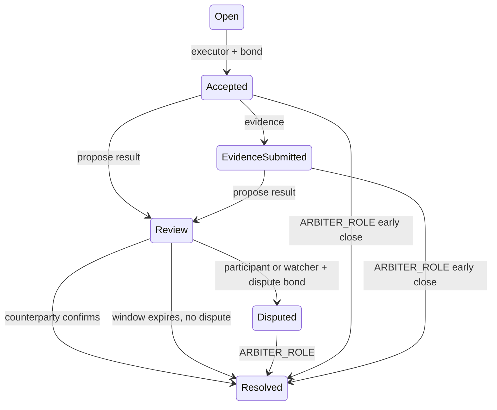

# Alterford v1.1 - Phase 1 Resilience and Security Specification

Status: Implemented candidate  
Network target: Base Sepolia, then Base Mainnet  
Compatibility: Constitution v1.1; no-house-risk; existing fee and dynamic bond policies unchanged

## 1. Scope

This phase adds four bounded capabilities without replacing the existing architecture:

1. Reproducible static PWA publication to IPFS and stable releases to Arweave.
2. EIP-712 authorized market bets with off-chain authorization and on-chain settlement.
3. Fully escrowed bounties plus emergency recovery through a council-controlled vault.
4. Optimistic challenge resolution with mutual confirmation, bonded disputes and final on-chain arbitration.

Web3Auth, EIP-2771 relaying, account abstraction and fiat on-ramp remain Phase 2 work.

## 2. Trust boundaries

| Boundary | Authority | Constraint |
| --- | --- | --- |
| Market bettor | EOA or ERC-1271 wallet | Signs an exact EIP-712 authorization; funds remain in the bettor wallet until settlement. |
| Relayer | Any address or one explicitly authorized address | Cannot alter bettor, market, outcome, amount, nonce or deadline. |
| Bounty security council | `SECURITY_ADMIN_ROLE` on `BountyRecoveryVault` | Can recover only while `BountyFactory` is paused and an incident hash is supplied. |
| Cold wallet | Immutable vault destination | Only destination accepted by the vault withdrawal path. |
| Challenge participants | Creator and executor | May propose; the counterparty may confirm; either may dispute. |
| Authorized watcher | `WATCHER_ROLE` | May dispute but cannot decide the result. |
| Arbiter | `ARBITER_ROLE` | Final authority for disputed or early challenge resolution. |

## 3. Market EIP-712 authorization

Domain:

- name: `AlterfordMarketFactory`
- version: `1`
- chain id: dynamic `block.chainid`
- verifying contract: deployed `MarketFactory`

Typed payload:

| Field | Type | Meaning |
| --- | --- | --- |
| `bettor` | `address` | Token owner and signer. |
| `marketId` | `uint256` | Target market. |
| `outcome` | `uint8` | Selected outcome index. |
| `amount` | `uint256` | Exact settlement-token amount. |
| `nonce` | `uint256` | Must equal `nonces[bettor]`. |
| `deadline` | `uint256` | Last valid block timestamp. |
| `authorizedRelayer` | `address` | Zero permits any submitter; otherwise only this address. |

Execution uses OpenZeppelin `EIP712` and `SignatureChecker`, therefore supporting EOAs and ERC-1271 wallets. The nonce is consumed before token interaction and all state rolls back on transfer failure. `invalidateNonce` cancels all lower outstanding authorizations.

## 4. Bounty escrow and recovery

Creation transfers `rewardPool + creationBond` into `BountyFactory`. Resolution requires:

- at least one winner;
- at most 100 winners per atomic settlement;
- one amount per winner;
- unique non-zero winners;
- an existing submission for every winner;
- non-zero payouts;
- exact equality between payout sum and escrowed reward.

Successful resolution pays winners and returns the creator bond. Cancellation returns reward and bond. Both are idempotent through state and finalized-bond guards.

Emergency sequence:

1. `PAUSER_ROLE` pauses `BountyFactory`.
2. A council member holding `SECURITY_ADMIN_ROLE` calls `emergencyRecoverBounty` with a non-zero incident hash.
3. The factory clears tracked reward and bond before interaction and transfers exactly that amount to `BountyRecoveryVault`.
4. The council calls `recoverToColdWallet`; the destination is immutable.

No generic arbitrary destination exists. A recovered bounty enters `EmergencyRecovered` and cannot be recovered twice.

## 5. Optimistic challenge resolution

Standard challenge duration is capped at 24 hours. Its resolution window is governor-configurable between 12 and 24 hours and defaults to 24 hours. Reward pools at or above 1,000 USDT, or risk levels High/Critical, use a 48-hour maximum/window. Underworld mode alone does not grant a 48-hour window.

Lifecycle:

Dispute bond formula:

`clamp(rewardPool * 2%, 1 USDT, 100 USDT)`

If arbitration changes the proposed result, the disputant receives the bond back. If arbitration upholds the proposal, the bond is slashed to the final winner. Creator and executor bonds retain their existing release/slash behavior.

## 6. Static PWA publication

The web app produces one provider-agnostic `dist`:

- Vite `base` is `./`;
- source maps are disabled;
- manifest and navigation are relative;
- shell and immutable local assets are cached;
- RPC, indexer, WalletConnect, OAuth, relayer and on-ramp traffic is always network-only;
- cross-origin and POST traffic is never cached.

Publication channels:

- IPFS fast release: Pinata or Fleek selected with `PINNING_PROVIDER`.
- Arweave stable release: explicit stable pipeline via Irys.
- preflight rejects localhost references, source maps and secret-like content in public artifacts.

## 7. Deployment invariants

Base Sepolia reuses the current settlement token and `CreationBondPolicy`. It deploys new Market, Bounty and Challenge factories plus `BountyRecoveryVault`. Preflight requires:

- Foundry keystore account and password file or interactive mode;
- settlement token and bond policy addresses with bytecode;
- distinct valid `SECURITY_COUNCIL_ADDRESS` and `COLD_WALLET_ADDRESS`;
- correct chain id and funded deployer;
- compiled artifacts for all six registered contracts.

Local Anvil remains compatible with its deterministic development key and uses the local deployer as council/cold wallet only for testing.

## 8. Acceptance tests

- EIP-712 valid signature, restricted relayer, nonce consumption and replay rejection.
- Bounty reward plus bond escrow, exact multi-winner payout and bond return.
- Emergency recovery fails while unpaused, succeeds for council while paused and is idempotent.
- Challenge mutual confirmation closes early.
- Bonded dispute is decided only by arbiter and settles all tracked balances.
- 24-hour standard and 48-hour high-value/high-risk windows.
- Full legacy Solidity suite remains green.
- Static build passes publication preflight and PWA configuration tests.
- SDK/indexer/frontend compile and test against the same ABI surface.
